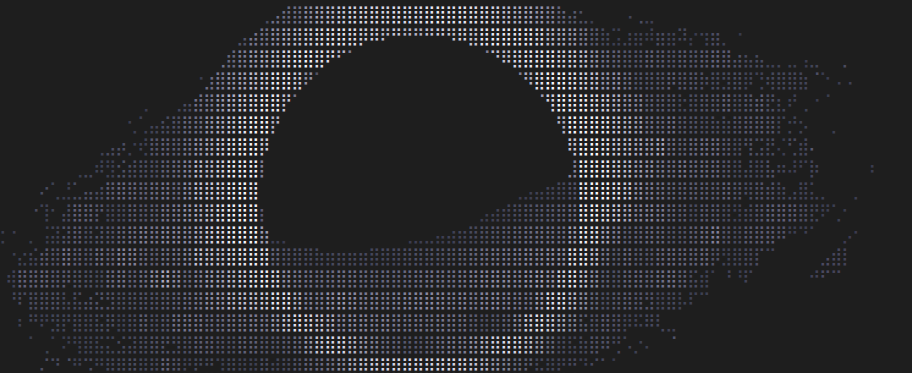

# Anifetch - neofetch but animated.

This is a small tool built with neofetch, ffmpeg and chafa. It allows you to use neofetch while having animations.

## How to Install

You need `chafa` to be installed. For debian/ubuntu it is `apt install chafa`. [Download Instructions](https://hpjansson.org/chafa/download/)

if you don't have ffmpeg, download it here: [ffmpeg download](https://www.ffmpeg.org/download.html)

Clone the git repo.

```cmd
git clone https://github.com/Notenlish/anifetch
```

You don't need to setup an venv or install any python modules.

If you want sound support, you will need to install `sox` and `libsox-fmt-mp3`.

For Ubuntu/Debian systems it's `sudo apt-get install sox libsox-fmt-mp3` to install it.

## How to Use It

Your neofetch logo file should only include a single character for the ascii art. Anifetch will attempt to find it and replace it with the chafa animation output. An example logo file can be found in `example-logo.txt`

An example neofetch config can be found here: `example-config.conf`

Simply place your video/gif file in the project folder. There's an already included test file called `video.mp4`, you can use that if you want.

Then run `python3 anifetch.py -f [filename] --framerate 10 --width 40 --height 20 -c "[add optional chafa arguments]"`.

Here's an example command: `python3 anifetch.py -f "video.mp4" -r 10 -W 40 -H 20 -c "--symbols wide --fg-only"`

Run `python3 anifetch.py --help` if you need help.

## Creating a Shortcut

Just create an shell alias.

for bash it is: `alias anifetch='your-command'`

## Benchmarks

Here's the benchmark from running each cli 10 times. Tested on Linux Mint with Intel I5-12500H.

| CLI       | Time Taken(total) | Time Taken (avg) |
| --------- | ----------------- | ---------------- |
| neofetch  | 4.90 seconds     | 0.49 seconds   |
| fastfetch | 0.07 seconds     | 0.007 seconds    |
| anifetch(nocache)(neofetch)  | 5.67 seconds     | 0.57 seconds   |
| anifetch(cache)(neofetch)  | 5.50 seconds     | 0.55 seconds   |
| anifetch(nocache)(fastfetch)  | 0.36 seconds     | 0.036 seconds   |
| anifetch(cache)(fastfetch)  | 0.37 seconds     | 0.037 seconds   |

As it can be seen, **Anifetch** is quite fast, especially when you cache the animations and use it with fastfetch.

## Notes

Anifetch attempts to cache ffmpeg output so that it doesn't need to render them again when you run it with the same file. However, if the name of the file is the same, but it's contents has changed, it won't re-render it. In that case, you will need to add `--force-render` as an argument to `anifetch.py` so that it re-renders it. You only have to do this only once when you change the file contents.

You should probably make sure that the video's height (in lines) is lower or equal to the height of the neofetch output. Otherwise it will probably give an IndexError.

Also, ffmpeg can generate the the same image for 2 consecutive frames. Try changing the framerate if that happens. Or just increase the playback rate.

## What's Next

- [ ] Fix the potential IndexError that comes when chafa output in lines is higher than the neofetch output.

- [X] Add music support

- [X] Cache chafa output

- [X] Make it faster

- [X] Only save the template + animation frames, dont save the animation frames with the layout applied to them.

- [X] Add fastfetch support.

- [X] Instead of just saving the filename for cache validation, save the width and height as well.

- [X] Seperate frame generation framerate(ffmpeg) and video playback framerate

## Credits

Neofetch: [Neofetch](https://github.com/dylanaraps/neofetch)

I got the base neofetch config from here, spesifically the Bejkon 2 config file: [Neofetch Themes by Chick2D](https://github.com/Chick2D/neofetch-themes)
