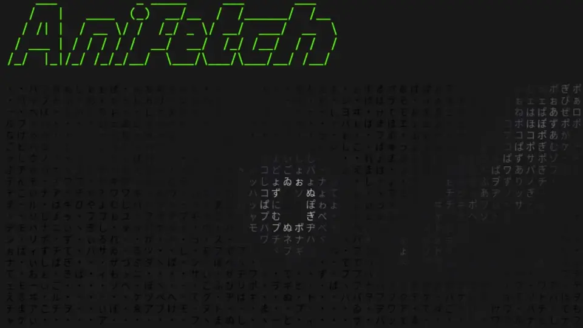

# Anifetch - Neofetch but animated.

This is a small tool built with neofetch/fastfetch, ffmpeg and chafa. It allows you to use neofetch or fastfetch while having animations.

## How to Install
You need `bc` to be installed. For debian/ubuntu it's `apt install bc`. For Arch it's `pacman -S bc`.

You need `chafa` to be installed. For debian/ubuntu it is `apt install chafa`. [Download Instructions](https://hpjansson.org/chafa/download/)

if you don't have ffmpeg, download it here: [ffmpeg download](https://www.ffmpeg.org/download.html)

Clone the git repo.

```cmd
git clone https://github.com/Notenlish/anifetch
```

You don't need to setup an venv or install any python modules.

Sound functionality is added via `ffplay`. If you install ffmpeg via a package manager like `apt` it should also install it automatically.

## How to Use It

Your neofetch logo file should only include a single character for the ascii art. Anifetch will attempt to find it and replace it with the chafa animation output. An example logo file can be found in `example-logo.txt`. Fastfetch doesnt need any special configuration.

An example neofetch config can be found here: `example-config.conf`

Simply place your video/gif file in the project folder. There's an already included test file called `video.mp4`, you can use that if you want.

Then run `python3 anifetch.py -f [filename] --framerate 10 --width 40 --height 20 -c "[add optional chafa arguments if you want]"`.

Here's an example command: `python3 anifetch.py -f "video.mp4" -r 10 -W 40 -H 20 -c "--symbols wide --fg-only"`

Run `python3 anifetch.py --help` if you need help.

You can also play a sound via `-s [sound filename]`.

## Creating a Shortcut

Just add an shell alias to your `~/.bashrc` file. Example: `alias anifetch='python3 [path-to-anifetch.py] -f [path-to-video-file]'`

## Benchmarks

Here's the benchmark from running each cli 10 times. Tested on Linux Mint with Intel I5-12500H.

| CLI                          | Time Taken(total) | Time Taken (avg) |
| ---------------------------- | ----------------- | ---------------- |
| neofetch                     | 4.996 seconds     | 0.500 seconds    |
| fastfetch                    | 0.083 seconds     | 0.008 seconds    |
| anifetch(nocache)(neofetch)  | 77.071 seconds    | 7.707 seconds    |
| anifetch(cache)(neofetch)    | 5.348 seconds     | 0.535 seconds    |
| anifetch(nocache)(fastfetch) | 73.414 seconds    | 7.341 seconds    |
| anifetch(cache)(fastfetch)   | 0.382 seconds     | 0.038 seconds    |

As it can be seen, **Anifetch** is quite fast if you cache the animations, especially when paired with fastfetch.

## Notes

Anifetch attempts to cache the animation so that it doesn't need to render them again when you run it with the same file. However, if the name of the file is the same, but it's contents has changed, it won't re-render it. In that case, you will need to add `--force-render` as an argument to `anifetch.py` so that it re-renders it. You only have to do this only once when you change the file contents.

Also, ffmpeg can generate the the same image for 2 consecutive frames, which may make it appear like it's stuttering. Try changing the framerate if that happens. Or just increase the playback rate.

Seperating video into frames takes some time and can potentially use up a lot of space during caching. After caching is done the video images will be deleted. Also note that you need to set the same framerate as the audio when playing a video. Otherwise video and audio will desync.

If you set animation resolution really big it may not be able to keep up with the audio. I have plans for optimizing the script so this is less of an issues.

Currently only the `symbols` format of chafa is supported, formats like kitty, iterm etc. are not supported. If you try to tell chafa to use iterm, kitty etc. it will just override your format with `symbols` mode.

## What's Next

- [x] Add music support

- [x] Cache chafa output

- [x] Make it faster

- [x] Only save the template + animation frames, dont save the animation frames with the layout applied to them.

- [x] Add fastfetch support.

- [x] Instead of just saving the filename for cache validation, save the width and height as well.

- [x] Seperate frame generation framerate(ffmpeg) and video playback framerate

- [x] Fix audio sync issues.

- [ ] Add an info text that updates itself when caching.

- [ ] Allow setting ffmpeg args.

- [ ] Use threading when seperating video into frames and process them with chafa at the same time. This should speed up caching significantly.

- [ ] Fix transparent video frame seperation.

- [ ] Figure out a way to display animations faster. Either optimize the bash script or use Python/C.

- [ ] Support different formats like iterm, kitty, sixel etc.

- [ ] Allow the user to provide their own premade frames in a folder instead of an video.

- [ ] Update the animated logo on the readme so that its resolution is smaller + each individual symbol is bigger.

- [ ] Create an installer bash script to provide an easy installation option for people.

- [ ] Add an option to generate an mp4 with the terminal rendered animation(for putting it as a desktop background)

## Credits

Neofetch: [Neofetch](https://github.com/dylanaraps/neofetch)

I got the base neofetch config from here, spesifically the Bejkon 2 config file: [Neofetch Themes by Chick2D](https://github.com/Chick2D/neofetch-themes)

I'd like to thank Pewdiepie for creating his Linux video. I got the inspiration for this tool from his video. [Video](https://m.youtube.com/watch?v=pVI_smLgTY0&t=878s&pp=ygUJcGV3ZGllcGll)
